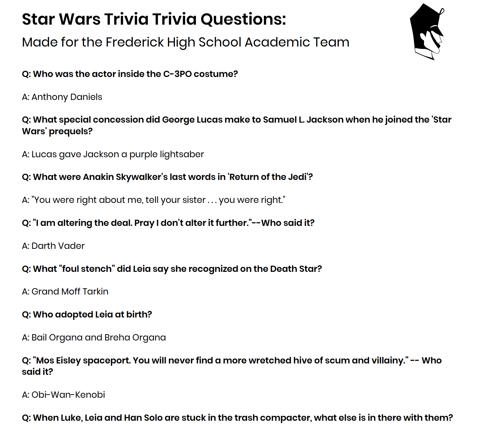

# Academic Team Special Categories
🤓 Web Scaper and PDF Creator used to help the FHS Academic Team.

## Motivation
With our team growing in size, Ms. Strakonsky, our Academic Team Coach, asked us to write some questions for special category rounds, which are rounds during each match with questions set aside simply for a certain topic. This year, the topics ranged from anything to Star Wars to World War II.

Given the lack of time that I had to write any questions down, I was wondering if I could use some BeautifulSoup and Python to help me scrape the web for some questions. Sure enough, I was right.

## Description
This project makes use of Python, BeautifulSoup, and FPDF for Python to help get questions from Quizlet, organize the flashcards into questions and answers, and displays them into a beautiful PDF that is saved to the user's directory. Since Quizlet has paused issuing new API keys since December of 2018, the task of parsing through Quizlet's database proved to be harder than I imagined.

## Technology Used
The following libraries were used to help create SAT Question a Day:
1. BeautifulSoup
  - Used to help extract the content from Quizlet.
2. HTML Parser
  - Used to help parse through the data and correctly distinguish the the terms from the definitions. Text was saved eventually to a .txt file.
3. FPDF for Python
  - Used to help create a beautiful PDF using the csv library to help parse through an existing .txt file.
  
## Checklist
- [X] Add header image of a Cadet to each page.
- [ ] Continue to create more PDFs for special categories
- [ ] Stream for potentially other sites?
